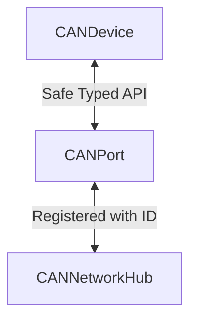

# 提案3: 中間「ポート」オブジェクトによる依存の分断

この提案では、デバイスとマネージャーの間に **`CANPort`** (または `CANLink`) という軽量な中間オブジェクトを挟むことで、直接的な依存関係を断ち切ります。

## 1. クラス名の変更による役割の明確化

`CANManager` を **`CANNetworkHub`** （CANネットワークハブ）に変更します。
これは、複数の接続ポート（Port）を束ね、ハードウェア（Driver）との仲介を行う役割を表します。

## 2. 循環参照の解消とデータフローの整理

デバイスは `CANNetworkHub` 全体機能にアクセスする必要はなく、自分専用の「通信口」があれば十分です。

### クラス構造の変更

1. **`CANPort` (新規作成)**
   - デバイスとハブをつなぐパイプ役です。
   - **受信フィルターID** を属性として持ち、自分宛てのメッセージだけを通過させます。
   
   ```cpp
   class CANNetworkHub; // 前方宣言
   
   class CANPort {
       CANNetworkHub& hub_;
       uint32_t filter_id_;
   public:
       CANPort(CANNetworkHub& hub, uint32_t filter_id) 
           : hub_(hub), filter_id_(filter_id) {
           // コンストラクタ内でハブに自身を登録
           hub.register_port(this, filter_id_);
       }

       bool send(const CANFrame& frame); // Hubの送信処理を呼び出す
       
       // Hubから呼び出される受信関数
       virtual void push_receive(const CANFrame& frame) = 0;
   };
   
   // テンプレートを使って型安全にデバイスに渡すことも可能
   template<typename DeviceT>
   class DevicePort : public CANPort {
       DeviceT* device_;
   public:
       void bind(DeviceT* dev) { device_ = dev; }
       void push_receive(const CANFrame& frame) override {
           if(device_) device_->on_receive(frame);
       }
   }
   ```

2. **`CANDevice`**
   - `CANNetworkHub` ではなく `CANPort` （またはその派生）を保持します。
   - フィルタリング済みのデータのみが届くことを前提に実装できます。
   
   ```cpp
   class CANDevice {
       CANPort& port_;
   public:
       CANDevice(CANPort& port) : port_(port) {
           // 必要ならここで callback を bind するなど
       }
       
       void some_activity() {
           port_.send(frame);
       }
       
       void on_receive(const CANFrame& frame) {
            // IDチェック不要
            // ...
       }
   };
   ```

3. **`CANNetworkHub` (旧 CANManager)**
   - ドライバーと複数の `CANPort` を管理します。
   - 内部にルーティングテーブルを持ち、受信データを適切なポートへ配送します。

   ```cpp
   class CANNetworkHub {
       std::map<uint32_t, CANPort*> ports_;
       drivers::DriverInterface& driver_;
   public:
       void register_port(CANPort* port, uint32_t id) {
           ports_[id] = port;
       }

       void update() {
           CANFrame frame;
           while(driver_.receive(frame)) {
               if (ports_.count(frame.id)) {
                   ports_[frame.id]->push_receive(frame);
               }
           }
       }
   };
   ```

### データフロー



### メリット
- **スケーラビリティ**: 「ポート」という概念を導入することで、デバイス毎に送信キューを持たせたり、フィルタリング設定をポートに持たせるなど、機能拡張がしやすくなります。
- **構成の安全性**: デバイスは `CANNetworkHub` の管理機能（他のデバイスの登録解除など）にアクセスできなくなるため、カプセル化が強化されます。

### デメリット
- **クラス数の増加**: 管理すべきクラスが増え、初期化時の配線（Wiring）コードが少し複雑になります。
- **間接参照**: 呼び出しの階層が一段階増えます。

## 4. 使用例 (main.cpp)

```cpp
#include "gn10_can/core/can_network_hub.hpp"
#include "gn10_can/drivers/stm32_can/driver_stm32_can.hpp"
#include "gn10_can/core/can_port.hpp"
#include "my_motor_driver.hpp"

int main() {
    gn10_can::drivers::Stm32CanDriver driver;
    gn10_can::CANNetworkHub hub(driver);

    // 1. ポートの作成
    // ID: 0x300 を受信用として hub に登録しながらポートを作成
    gn10_can::CANPort motor_port(hub, 0x300);

    // 2. デバイスの作成
    // デバイスは Port だけを知っている
    MyMotorDriver motor(motor_port);
    
    // (オプション) ポートとデバイスの受信バインド
    // ポートが受信したデータをデバイスに渡すための設定
    // ※実装パターンによるが、Portの派生クラスを使う場合などは自動化可能
    motor_port.set_callback([&](const auto& f){ motor.on_receive(f); });

    while (true) {
        // Hub -> Port -> Device の順でデータが流れる
        hub.update();
    }
}
```
